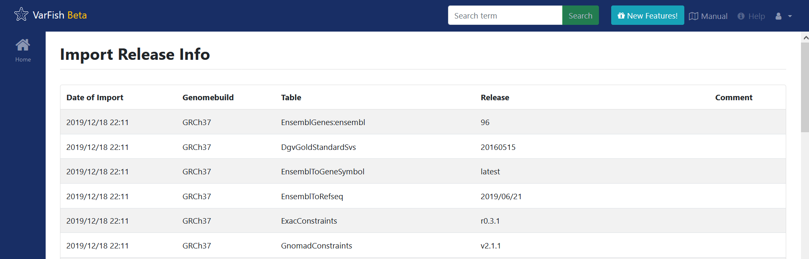

.. admin_update_db:

=====================
Updating the Database
=====================

This is usually not required as the VarFish team provides prebuilt databases and packaged data.
In the case that you want to do this on your own, here is how to do this.

First, the tables that are to be updated should be generated. For this,
follow the instructions in the
`VarFish DB Downloader repository <https://github.com/varfish-org/varfish-db-downloader/#building-specific-tables>`_.

At this point you should have a folder structure available that resembles::

    varfish-db-downloader/
        GRCh37/
            <table_group>/
                <version>/
                    <table>.tsv
                    <table>.release_info
        GRCh37/
            [...]
        noref/
            [...]
        import_versions.tsv
        [...]

If the HPO and OMIM tables are supposed to be updated, it would look like this::

    varfish-db-downloader/
        noref/
            hpo/
                20220126/
                    Hpo.release_info
                    Hpo.tsv
                    HpoName.release_info
                    HpoName.tsv
            mim2gene/
                20220126/
                    Mim2geneMedgen.release_info
                    Mim2geneMedgen.tsv
        import_versions.tsv
        [...]

Copy this structure on to the machine where the Docker compose is running.
Take Docker compose down (this will shut down your VarFish instance!):

.. code-block:: bash

    $ cd varfish-docker-compose  # make sure to be in the docker compose folder
    $ docker-compose down

Modify the ``docker-compose.yml`` file by finding the following entry::

      varfish-web:
        image: ghcr.io/varfish-org/varfish-server:VERSION
        env_file:
          - .env
        networks:
          - varfish
        restart: unless-stopped
        volumes:
          - "/root/varfish-server-background-db-20210728b:/data:ro"
        [...]

And add another volume that maps your directory into the container::

        volumes:
          - "/root/varfish-server-background-db-20210728b:/data:ro"
          - type: bind
            source: varfish-db-downloader/
            target: /data-db-downloader
            read_only: true

Start docker compose again:

.. code-block:: bash

    $ docker-compose up

Once done, attach to your container:

.. code-block:: bash

    $ docker exec -it varfish-docker-compose_varfish-web_1 bash -i

Switch to the application directory and start the import:

.. code-block:: bash

    varfish-web-container$ cd /usr/src/app
    varfish-web-container$ python manage.py import_tables --tables-path /data-db-downloader

The output of the command should look something like this::

    Disabling autovacuum on all tables...
    Hpo -- Importing Hpo 2022/01/26 (, source: /data-db-downloader/noref/hpo/20220126/Hpo.tsv) ...
    Mim2geneMedgen -- Importing Mim2geneMedgen 2022/01/26 (, source: /data-db-downloader/noref/mim2gene/20220126/Mim2geneMedgen.tsv) ...
    Hpo -- Removing old Hpo results.
    Mim2geneMedgen -- Removing old Mim2geneMedgen results.
    Mim2geneMedgen -- Importing new Mim2geneMedgen data
    Hpo -- Importing new Hpo data
    Mim2geneMedgen -- Finished importing Mim2geneMedgen 2022/01/26 (Mim2geneMedgen.tsv)
    Hpo -- Finished importing Hpo 2022/01/26 (Hpo.tsv)
    HpoName -- Importing HpoName 2022/01/26 (, source: /data-db-downloader/noref/hpo/20220126/HpoName.tsv) ...
    HpoName -- Removing old HpoName results.
    HpoName -- Importing new HpoName data
    HpoName -- Finished importing HpoName 2022/01/26 (HpoName.tsv)
    Enabling autovacuum on all tables...

To verify the import, switch to the VarFish web interface, find the users menu
on the top right corner and select the ``Import Release Info`` entry. The
updated tables should have the latest version.

