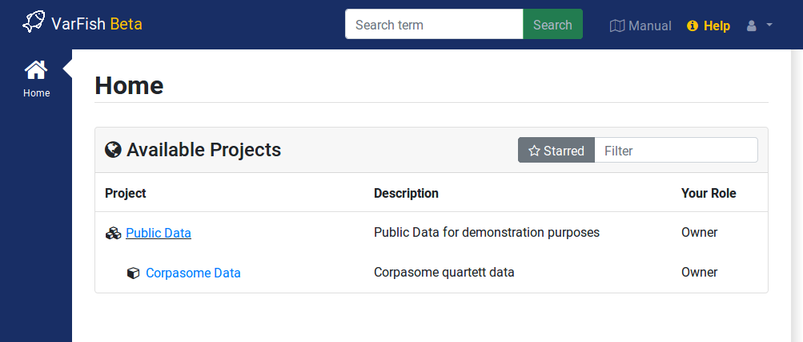

.. _manual-main:

===================
VarFish User Manual
===================

VarFish is a system for the filtration of variants.
Currently, the main focus is on small/sequence variants called from high-througput sequencing data (in contrast to structural variants).

This is the documentation aimed at VarFish end users and operators (administrators).
The development documentation can be found at `varfish-dev-docs.readthedocs.io <https://varfish-dev-docs.readthedocs.io/>`__.

    The VarFish global "home" screen showing the demo project with the Corpas family quartet.

.. important::

    VarFish is *for research use only* software.

.. raw:: latex

    \part{Projects \& Navigation}

.. toctree::
    :maxdepth: 1
    :caption: Projects / Navigation
    :name: project-navigation
    :hidden:
    :titlesonly:

    projects_permissions
    projects_search

.. raw:: latex

    \part{Miscellaneous (UI) Features}

.. toctree::
    :maxdepth: 1
    :caption: Misc UI Features
    :name: misc-ui-features
    :hidden:
    :titlesonly:

    ui_user_menu
    ui_api_tokens
    ui_user_profile
    ui_release_info

.. raw:: latex

    \part{Cases \& Variants}

.. toctree::
    :maxdepth: 1
    :caption: Tutorials
    :name: tutorials
    :hidden:
    :titlesonly:

    tutorials_igv
    tutorials_kiosk

.. toctree::
    :maxdepth: 1
    :caption: Cases & Variants
    :name: cases-variants
    :hidden:
    :titlesonly:

    variants_cases
    variants_stats_qc
    variants_filtration
    variants_project_wide
    variants_annotation

.. toctree::
    :maxdepth: 1
    :caption: Resources
    :name: Resources
    :hidden:
    :titlesonly:

    databases

.. raw:: latex

    \part{Administrator's Manual}

.. toctree::
    :maxdepth: 1
    :caption: Administrator's Manual
    :name: installation-setup
    :hidden:
    :titlesonly:

    admin_install
    admin_update_db
    admin_extras
    admin_config
    admin_ingest
    admin_tuning
    admin_upgrade
    admin_pap
    admin_backup

.. raw:: latex

    \part{Variant Analysis SOPs}

.. toctree::
    :maxdepth: 1
    :caption: Variant Analysis SOPs
    :name: variant-analysis-sop
    :hidden:
    :titlesonly:

    sop_introduction
    sop_supporting
    sop_filtration

.. raw:: latex

    \part{REST API}

.. toctree::
    :maxdepth: 1
    :caption: REST API
    :name: api-docs
    :hidden:
    :titlesonly:

    api_overview
    api_projectroles
    api_importer
    api_case
    api_json_schemas
    api_beacon

.. raw:: latex

    \part{Notes}

.. toctree::
    :maxdepth: 1
    :caption: Notes
    :name: notes
    :hidden:
    :titlesonly:

    notes_clinvar

.. raw:: latex

    \appendix
    \part{Project Information}

.. toctree::
    :maxdepth: 1
    :caption: Project Info
    :name: project-info
    :hidden:
    :titlesonly:

    contributors
    release_cycle
    history
    glossary
    smallprint

Indices and tables
==================

* :ref:`genindex`
* :ref:`search`
