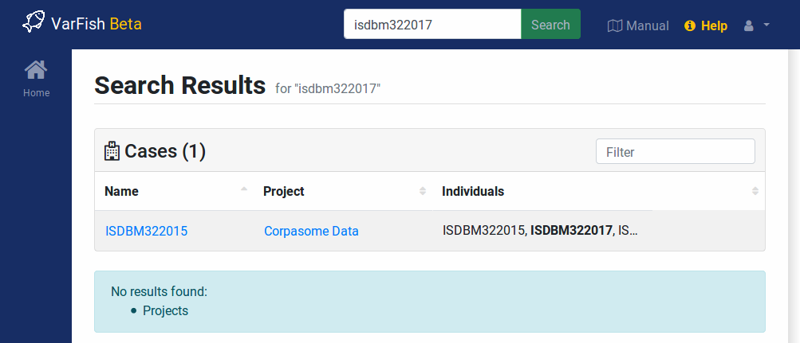

.. _projects_search:

================
Site-wide Search
================

You can use the search bar on the top to search the VarFish site for projects and cases.

- Your search terms are searched for in the project names and descriptions using case-insensitive but exact search.
  Partial matches are also reported (e.g., "exa" will match a project with "Example" in its name or title but "oxa" will not match).

- Your search term is searched for in case names and individuals in your cases as follows:

    - Matches are performed case-insensitive ("example" will match "Example").
    - Non-alphanumeric characters are removed ("#12-345" will match "12345").
    - Matches have to be end-to-end ("12345" will not match "id12345").

    Case insensitive search results.

