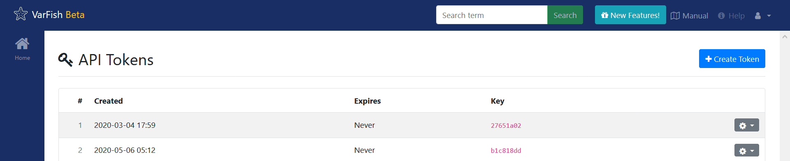

.. _ui_api_tokens:

====================
API Token Management
====================

This page allows for managing API tokens.
This feature is interesting if you want to use software (or develop one yourself) that interfaces with SODAR programatically,
or if you want to use the API import feature of VarFish to easily import your cases.

You can create API tokens with the :guilabel:`Create Token` button.
Each token can be deleted through the little cog button towards the right of the token list.
In the token list, you can see the time of creation, the expiry time, and the first 8 characters of the key.

Please note that after creating the token, you will only be able to see the first 8 characters again (for reidentification).
For security reasons, the token itself will be encrypted using a one-way hash function.
It is possible to check a given token to be the same as in the database, but it is not possible to retrieve a lost token.
Rather, one would discard the old one from VarFish and just create a new one.
Note that the token is completely independent from any token that you might obtain from a CUBI-developed or hosted web app (in particular it is separate from any SODAR API token).

Please also note that if you create and use an API token then, currently, whoever bears your token has the same permissions to the SODAR system through the API as your user.
Allowing to limit scope is on the list of future features, but currently this has not been implemented.

On creation, you can chose a number of hours that the token should be valid.
Using an expiry time of :guilabel:`0` will make the token never expire.
