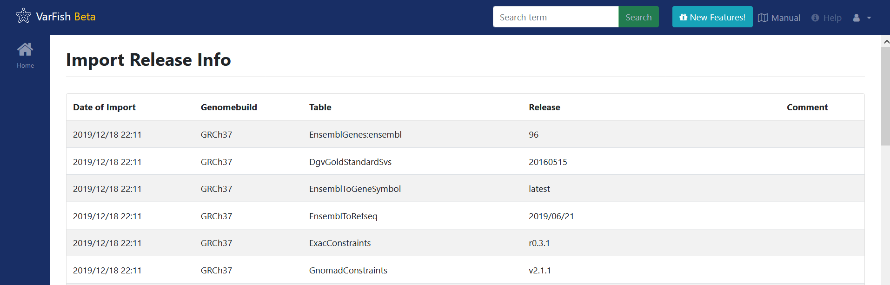

.. _ui_release_info:

===================
Import Release Info
===================

This screen displays the release version information of the background databases that have been imported into VarFish.
These are variants such as gnomAD or OMIM that are used for enriching variant annotation when displaying variant results.

Please note that the cases are annotated independently of the VarFish web server.
The databases used to annotate individual case VCFs can be found in the case overview.