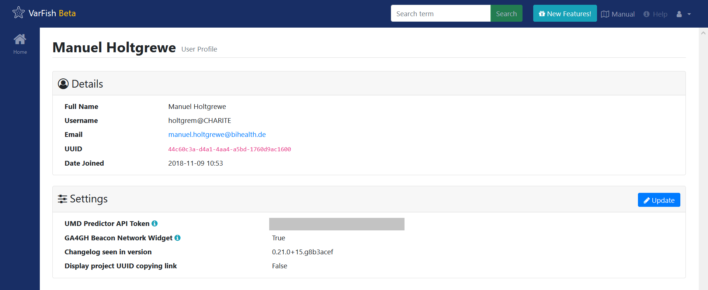

.. _ui_user_profile:

============
User Profile
============

The user profile screen displays information about your account to you.
Further, you can change global settings by using the :guilabel:`Update` link in the :guilabel:`Settings` box.

Currently, you can adjust the following settings:

UMD Predictor API Token
    For enabling variant pathogenicity score using the UMD predictor, add your API token here.
    For more information see `umd-predictor.eu <http://umd-predictor.eu/>`__.
GA4GH Beacon Network Widget
    Opt-in into displaying the Global Alliance for Genomes and Health Beacon Network Widget.
    This allows you to query the beacon network for variants that you see in your cases.
Changelog seen in version
    This value stores the last time that you clicked the :guilabel:`New Features!` button on.
    In a future version, this setting will be hidden from normal users.
Display project UUID copying link 
    Whether or not to display a little icon next to project name for easy copying of the project UUID to the clipboard.