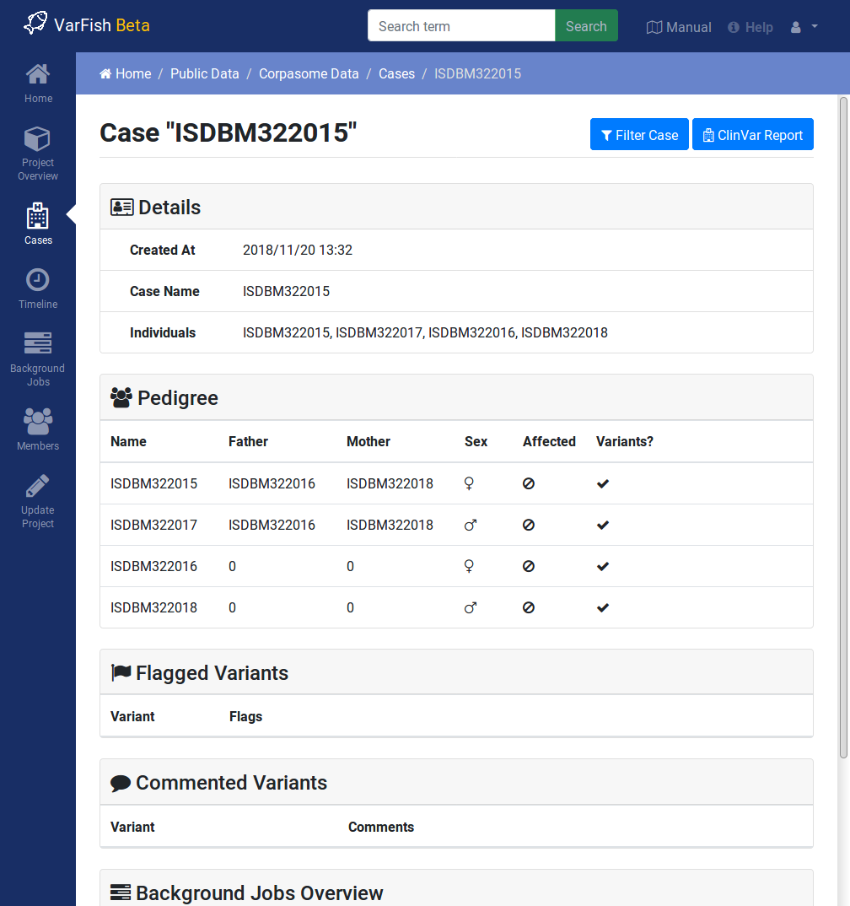

.. _variants_cases:

================
Variants & Cases
================

.. contents::

The variants are assigned to **Cases**.
Use the :guilabel:`Cases` link on the left to see all cases in a project.
Then, click on the case name to go to the case's detail view.

----------------
Case Detail View
----------------

On the case detail view, you can see the following information:

**Details**
    Case detail information such a creation date, case name, and name of individuals.

**Pedigree**
    The full pedigree information with the information whether variants are present for the individuals (i.e., whether it was sequenced).

**Flagged Variants**
    The variants flagged in the individual.

**Comment Variants**
    The variants that were commented in the individual.

**Background Jobs Overview**
    List of background job for this case, e.g., for file export generation.

    The case details view for the demo case.
    Note the details on the different aspects of the case and in particular the :guilabel:`Filter Case` and :guilabel:`ClinVar Report` buttons on the top right.

Case Detail View Actions
========================

On the top right, you can see the following button:

:guilabel:`Filter Case`
    This takes you to the :ref:`variants_filtration` view.
    Here you can filter the case's variant by a multitude of criteria including genotype, call quality, and variant effect.
