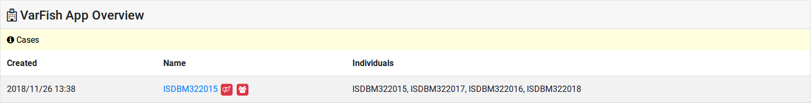
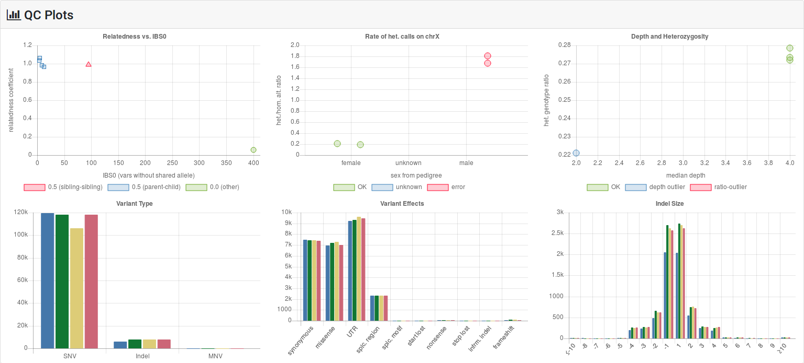

.. _variants_stats_qc:

=======================
Variant Statistics & QC
=======================

VarFish is providing you with advanced integrating tools for quality control (QC) of your variant calls.
When importing your cases, VarFish will compute statistics about the variants in your cases and check them with your pedigrees.

.. _sex_relation_qc:

-----------------
Sex & Relation QC
-----------------

The first consistency check performed is whether all individuals used as father or mother in your pedigree have the appropriate sex.
In the case of any issue, little red icons are displayed in your case listings and pedigree displays.

    Example for sex and relationship problems displayed in the case list.
    The little "venus-mars" icon indicates a problem with sex assignment, the little "people" icon indicates a problem with relationship.

The second check that is performed is computing the ratio of het./hom. calls on the X chromosome outside of the pseudo paralogous regions.
This ratio should be small for males and large for females.
Male samples whose ratio is above 1.0 and female samples whose ratio is below 1.0 are flagged as erroneous.
In the case of problems, little red icons are displayed in the same way as with the incorrect parent-sex assignment described above.

The third check that is performed is looking at the relationship of your parent-child and sibling-sibling pairs in each pedigree.
A relationship ratio is computed as well as the IBS0 value according to Pedersen & Quinlan (2018).
The relationship ratio is higher for closely related individuals (about 0.5 for parent-child and sibling-sibling pairs).
The IBS0 value is the number of variants that do not share any allele.
This value should be close to 0 for parent-child relations and also small for siblings.

--------
QC Plots
--------

Further, the case details view displays six plots helpful for variant quality control.

    The six statistics and QC plots described in this section.

Relatedness vs. IBS0
====================

For each sample pair in your pedigree, this plot shows the relatedness coefficient vs. the IBS0.
Parent-child relationship should cluster at the top-left.
The sibling-sinbling relationships should follow a bit further towards the right.
Unrelated individuals (e.g., parents in non-consanguineous families) should display on the lower right.

Rate of het. calls on chrX
==========================

This plot displays the rate of heterozygous over homozygous variants on the X chromosome outside of the pseudoautosomal regions.
This count is displayed for samples classified as male, female, and unknown in the pedigree.
Values falling on the wrong side of the threshold of 1.0 described in :ref:`sex_relation_qc` are colored red.

Depth and Heterozygosity
========================

This plot displays the fraction of heterozygous calls vs. the median depth.
Depth outliers are colored blue while ratio outliers are colored red.
Values are counted as outliers if they are more than 3 inter-quartile ranges from the median.
Keep this in mind when interpreting these plots.

Variant Type Histogram
======================

For each sample, the number of called on-exome SNVs, indels and MNVs is displayed.
Note that some variant callers such as the widely used GATK tools do not call MNVs but break them up into individual SNVs.
Thus the MNV count will be 0 in many cases.

Variant Effect Histogram
========================

For many relevant variant effect classes, the absolute frequency in on-exome variants is displayed in this histogram for each sample.

Indel Size Histogram
====================

The number of bases deleted (negative) and inserted (positive) from 1 to 20 is displayed in this histogram for each sample.

----------
QC Metrics
----------
