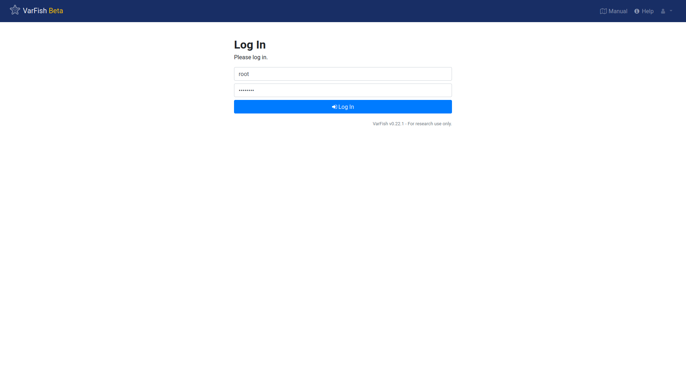

.. _admin_install:

============
Installation
============

This chapter describes how to install the VarFish core components and their requirements.
The audience of this chapter are those who want to install VarFish on their own infrastructure.

Since v0.22.1 (about February 2021), the recommended way of installing VarFish is using Docker Compose.
Docker Compose allows to describe the programs/services that are required to run VarFish as a site of Docker containers.
Docker containers allow to the whole runtime environment of complex software packages in a transparent and efficient manner.

For the following, knowledge of Linux administration and exposure to Docker is required.
Deeper knowledge to Docker and Docker Compose is of greater help in case of debugging.
In the case that have problems, please open an issue in our `Issue Tracker <https://github.com/varfish-org/varfish-docker-compose/issues>`__ or send an email to cubi-helpdesk@bihealth.de.
Please note that VarFish is academic software and we try to provide support on a best-effort.

You can find a quickstart-style manual in the `varfish-docker-compose <https://github.com/varfish-org/varfish-docker-compose#run-varfish-server-using-docker-compose>`__ README.

Note that this will only perform installation of VarFish and related services with data (re)distributed by the VarFish authors.
See :ref:`admin_extras` for installing extra services such as annotation with CADD scores.

.. _admin_install_prerequisites:

-------------
Prerequisites
-------------

- Hardware:
    - Memory: 64 GB of RAM
    - CPU: 16 cores
    - Disk: 600+ GB of free and **fast** disk space
        - about ~500 GB for initial database (on compression enabled ZFS it will consume only 167GB)
        - on installation: ~100 GB for data package file
        - per exome: ~200MB
        - a few (~5) GB for the Docker images
- Operating System:
    - a modern Linux that is `supported by Docker <https://docs.docker.com/engine/install/#server>`__.
    - outgoing HTTPS connections to the internet are allowed to download data and Docker images
    - server ports 80 and 443 are open and free on the host that run on this on
- Software:
    - Git
    - `Docker <https://docs.docker.com/get-docker/>`__
    - `Docker Compose <https://docs.docker.com/compose/install/>`__

Tuning database servers is an art of its own and you can have a look at the section :ref:`admin_tuning` for getting started.

.. _admin_install_with_docker_compose:

---------------------------
Install with Docker Compose
---------------------------

This section assumes that you have installed the prerequisites Git, Docker and Docker Compose.
So the following two commands should work.

.. code-block:: bash

    $ git version
    git version 1.8.3.1
    $ docker-compose -version
    docker-compose version 1.28.2, build 67630359
    $ docker version
    Client: Docker Engine - Community
     Version:           20.10.3
    [...]

First, we will obtain a checkout of ``varfish-docker-compose``.
This repository contains the ``docker-compose.yml`` and configuration files.
On execution, about ten Docker containers will be spun up, each running a part of the services that are required to run VarFish.
These include the Postgres database (that does the heavy lifting), Redis for caching, Jannovar for full functional effect annotation, Exomiser for variant priorisation, queue workers for performing database queries and similar tasks, and the VarFish web server itself.
But this will come later.

.. code-block:: bash

    $ git clone https://github.com/varfish-org/varfish-docker-compose.git
    $ cd varfish-docker-compose

Next, download and extract the VarFish site data archive which contains everything you need to get started (the download is ~100GB of data).
This will create the ``volumes`` directory (500GB of data, ZFS compression yields us 167GB disk usage).
Replace ``grch37`` with ``grch38`` in the command below if you want to use the GRCh38 release.
We currently only provide prebuilt databases for either GRCh37 or GRCh38.

.. code-block:: bash

    $ wget --no-check-certificate https://file-public.cubi.bihealth.org/transient/varfish/anthenea/varfish-site-data-v1-20210728b-grch37.tar.gz{,.sha256}
    $ sha256sum --check varfish-site-data-v1-20210728b-grch37.tar.gz.sha256
    $ tar xf varfish-site-data-v1-20210728b-grch37.tar.gz
    $ ls volumes
    exomiser  jannovar  minio  postgres  redis  traefik

The next step is to create an installation-specific configuration file ``.env`` as a copy of ``env.example``.
You will have to at least set ``DJANGO_SECRET_KEY`` variable to something random (a bash one-liner for this is `tr -dc A-Za-z0-9 </dev/urandom | head -c 64 ; echo ''`).

.. code-block:: bash

    $ cp env.example .env
    $ $EDITOR .env

You can now bring up the site with Docker Compose.
The site will come up at your server and listen on ports 80 and 443 (make sure that the ports are open), you can access it at ``https://<your-host>/`` in your web browser.
This will create a lot of output and will not return you to your shell.
You can stop the servers with ``Ctrl-C``.

.. code-block:: bash

    $ docker-compose up

You can also use let Docker Compose run the containers in the background:

.. code-block:: bash

    $ docker-compose up -d
    Starting compose_exomiser-rest-prioritiser_1 ... done
    Starting compose_jannovar_1                  ... done
    Starting compose_traefik_1                   ... done
    Starting compose_varfish-web_1               ... done
    Starting compose_postgres_1                  ... done
    Starting compose_redis_1                     ... done
    Starting compose_minio_1                     ... done
    Starting compose_varfish-celeryd-query_1     ... done
    Starting compose_varfish-celeryd-default_1   ... done
    Starting compose_varfish-celeryd-import_1    ... done
    Starting compose_varfish-celerybeat_1        ... done

You can check that everything is running (the versions might be different in your installation):

.. code-block:: bash

    $ docker ps
    3ec78fb9f12c   varfish-org/varfish-server:0.22.1-0                            "docker-entrypoint.s…"   17 hours ago   Up 31 seconds   8080/tcp                                   compose_varfish-celeryd-import_1
    313afb611ab1   varfish-org/varfish-server:0.22.1-0                            "docker-entrypoint.s…"   17 hours ago   Up 30 seconds   8080/tcp                                   compose_varfish-celerybeat_1
    4d865726e83b   varfish-org/varfish-server:0.22.1-0                            "docker-entrypoint.s…"   17 hours ago   Up 31 seconds   8080/tcp                                   compose_varfish-celeryd-query_1
    a5f90232c4da   varfish-org/varfish-server:0.22.1-0                            "docker-entrypoint.s…"   17 hours ago   Up 31 seconds   8080/tcp                                   compose_varfish-celeryd-default_1
    96cec7caebe4   varfish-org/varfish-server:0.22.1-0                            "docker-entrypoint.s…"   17 hours ago   Up 33 seconds   8080/tcp                                   compose_varfish-web_1
    8d1f310c9b48   postgres:12                                                 "docker-entrypoint.s…"   17 hours ago   Up 32 seconds   5432/tcp                                   compose_postgres_1
    8f12e16e20cd   minio/minio                                                 "/usr/bin/docker-ent…"   17 hours ago   Up 32 seconds   9000/tcp                                   compose_minio_1
    03e877ac11db   quay.io/biocontainers/jannovar-cli:0.33--0                  "jannovar -Xmx6G -Xm…"   17 hours ago   Up 33 seconds                                              compose_jannovar_1
    6af09b819e59   traefik:v2.3.1                                              "/entrypoint.sh --pr…"   17 hours ago   Up 33 seconds   0.0.0.0:80->80/tcp, 0.0.0.0:443->443/tcp   compose_traefik_1
    514cb4386224   redis:6                                                     "docker-entrypoint.s…"   19 hours ago   Up 32 seconds   6379/tcp                                   compose_redis_1
    5678b9e6797b   quay.io/biocontainers/exomiser-rest-prioritiser:12.1.0--1   "exomiser-rest-prior…"   19 hours ago   Up 34 seconds                                              compose_exomiser-rest-prioritiser_1

In the case of any error please report it to us via the `Issue Tracker <https://github.com/varfish-org/varfish-docker-compose/issues>`__ or email to cubi-helpdesk@bihealth.de.
Please include the full output as a text file attachment.

Actually, your VarFish website is now ready to be used.
Visit the website at `https://<your-host>/` and login with the account `root` and password `changeme`.

There will be a warning about self-signed certificates, see :ref:`admin_config_tls` on how to deal with this.
You can change it in the `Django Admin` (available from the menu with the little user icon on the top right).
You can also use the Django Administration interface to create new user records.

You will observe that the database came with some demo data sets of public IGSR data that are ready for exploration.

.. figure:: figures/admin/admin_view_project.png
    :align: center
    :width: 80%

--------------------------
Applying Necessary Updates
--------------------------

Depending on the VarFish version that you installed, you might need to install some data patches as described in :ref:`admin_upgrade`.
Notably:

- If you are using the original data version ``20210728`` then you need to apply the patch to ``20210728b`` as described in :ref:`admin_upgrade_data_release_20210728`.
- When installing ``v1.2.1`` then you need to apply the patch to data version ``20210728c``.
  This is done by first upgrading to ``20210728b`` (if you are not there already) and then upgrading to ``20210728c`` as described in :ref:`admin_update_1_2_2_to_1_2_3`.

In case of any issues, contact us in the `Github Discussion <https://github.com/varfish-org/varfish-server/discussions>`__ or directly by email.

