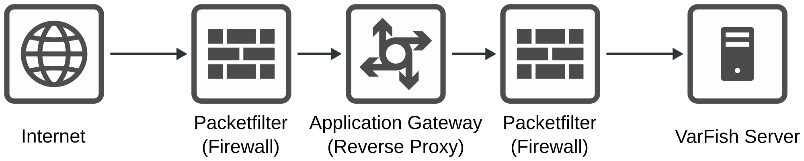

.. _admin_pap:

=================
PAP Configuration
=================

This section describes the setup of VarFish behind a PAP (package filter, application gateway, package filter) structure.

VarFish stores human genetic data which is by its very nature very privacy sensitives.
Administrators will thus want to set up VarFish in protected institution networks that are not accessible by the outside world.
However, certain data exchange is generally desired, such as connecting two or more VarFish instances with the clinical beacon protocol.

In such cases, the German agency for information security (BSI) recommends the P-A-P structure (`link to 2021 edition of their recommendation <https://www.bsi.bund.de/SharedDocs/Downloads/DE/BSI/Grundschutz/Kompendium_Einzel_PDFs_2021/09_NET_Netze_und_Kommunikation/NET_3_2_Firewall_Edition_2021.html>`__).

