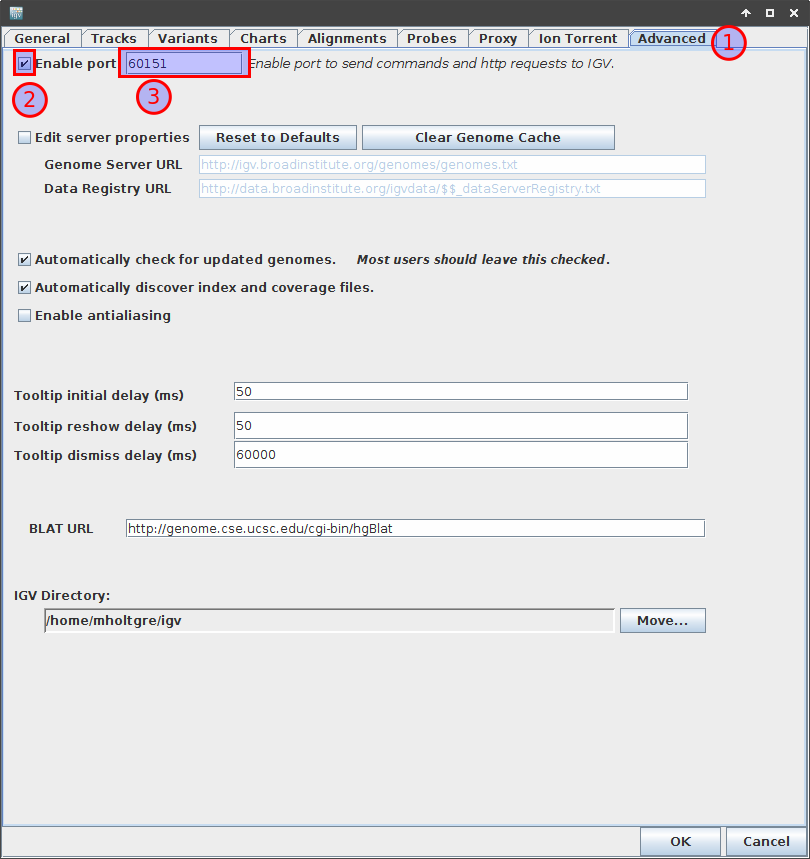

/vol/local/projects/Project_Flowcell/digestiflow-server/fileboxes/templates/fileboxes.. _tutorials_igv:

=================
IGV Configuration
=================

For each variant in the result set, VarFish provides you with a :guilabel:`IGV` link that will show the locus of the variant in the IGV browser window.
For this, you must have IGV running locally and properly configured.

For this, you have to go to the open the preferences window by first clicking the :guilabel:`View` menu entry and then the :guilabel:`Preferences` menu entry.
Select the :guilabel:`Advanced` tab.
There, make sure that the :guilabel:`Enable port` checkbox is ticket and the :guilabel:`port` value is set to ``60151``.
Finally, click :guilabel:`OK` to save your changes.

The settings is also illustrated in the following figure.

