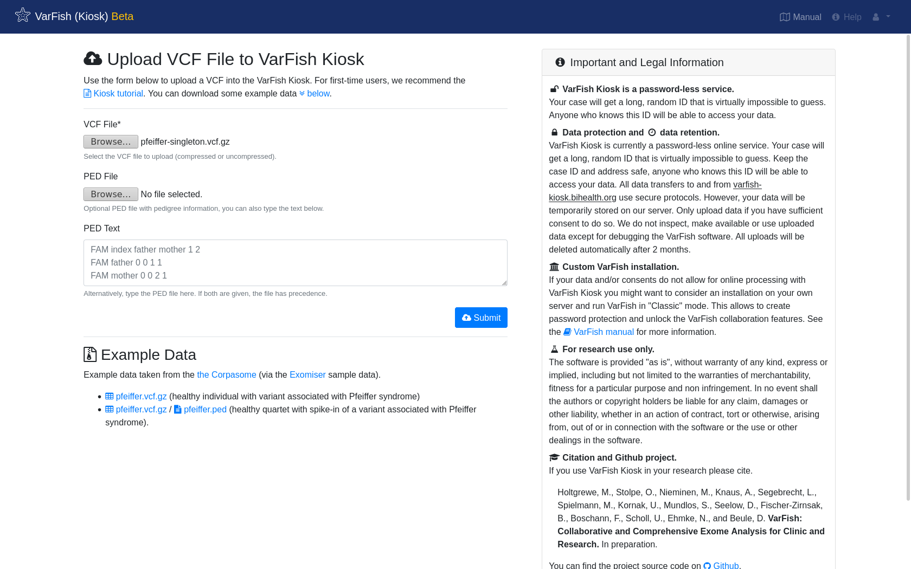
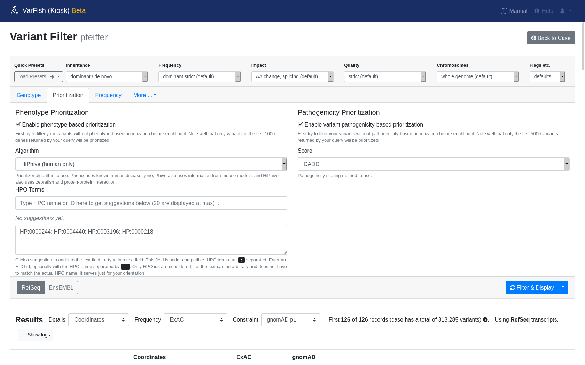
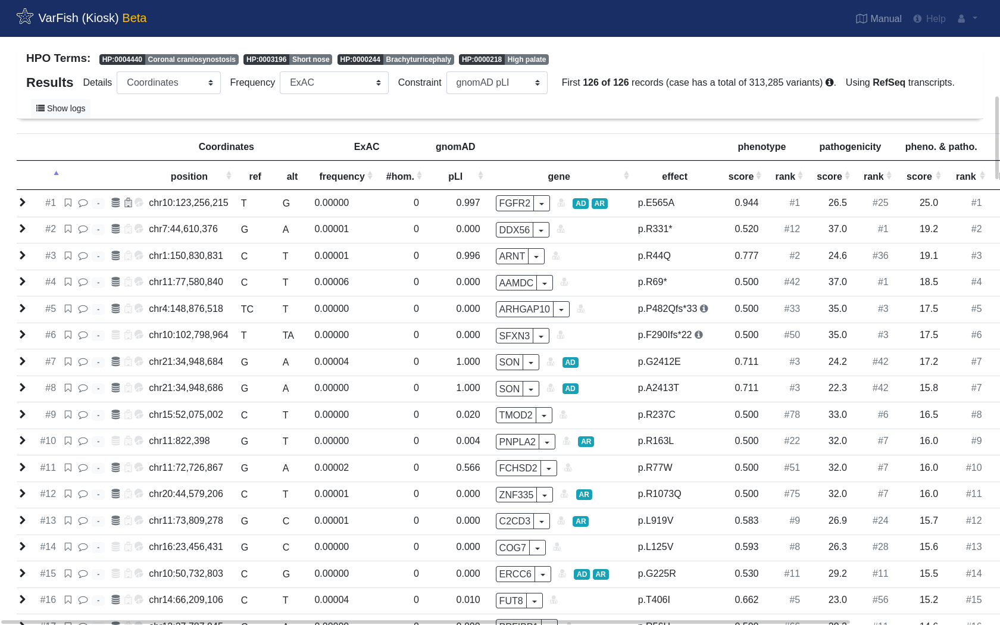
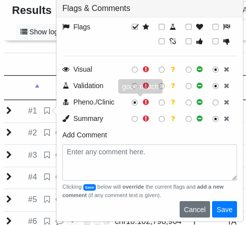
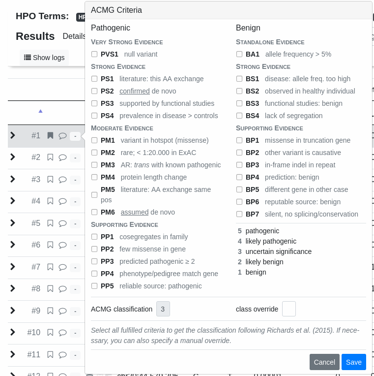
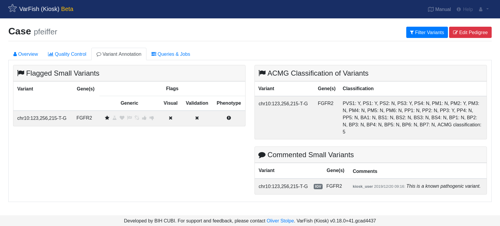
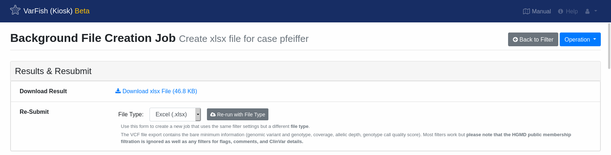

.. _tutorials_kiosk:

======================
VarFish Kiosk Tutorial
======================

This is the tutorial for the VarFish Kiosk mode.
It walks you through uploading a VCF into VarFish Kiosk and analyzing it using the filtration and prioritization features of VarFish.
Finally, you download the result as an Excel file.

.. note:: The VarFish Kiosk Mode

    VarFish can be run in two modes of operation:
    (1) The "classic" mode is available on site-specific installations and has all the features including multi case projects and allows for multiple users to collaborate.
    (2) The "kiosk" mode that is available centrally at https://varfish-kiosk.bihealth.org.
    Here you can upload your cases for analyzing them, all data will be discarded after 2 weeks.

In the case of any questions or problems, don't hesitate to contact `Manuel Holtgrewe <mailto:manuel.holtgrewe@bihealth.de>`_.

---------------------
Download Example Data
---------------------

Please first download the `pfeiffer-singleton.vcf.gz <https://github.com/bihealth/varfish-server/raw/master/docs_manual/assets/pfeiffer-singleton.vcf.gz>`_ file.
This is the exome data published into the public domain by Manuel Corpas as the `corpasome <https://figshare.com/articles/Corpasome/693052>`_ with a spike-in of the variant ``FGFR2:p.Glu566Gly`` which is associated with `Pfeiffer syndrome in ClinVar <https://www.ncbi.nlm.nih.gov/clinvar/RCV000415495/>`_.
The example data is taken from the `Exomiser project <https://github.com/exomiser/Exomiser>`_.

-----------
Data Upload
-----------

Next, navigate to https://varfish-kiosk.bihealth.org/ and you will be presented with the following screen.

Select the previously downloaded ``pfeiffer-singleton.vcf.gz`` as :guilabel:`VCF File` and click :guilabel:`Submit`.
Optionally, you can upload a pedigree information file with the :guilabel:`PED File` field or give its text content in the text field :guilabel:`PED Text` below.
The example VCF file only contains one sample so this is not necessary here.

.. note:: PED Files

    If you have a VCF file with multiple samples and do not specify the VCF file then no family information will be available subsequently.
    The PED file format is as follows.
    Each line gives the information of one pedigree member.
    Each line has the following format (separated by spaces):
    Family ID (if uncertain, put ``FAM``), name of person, name of father (``0`` if founder), name of mother (``0`` if founder), specification of sex (``1`` for male, ``2`` for female, ``0`` if unknown), specification of disease (``1`` for unaffected, ``2`` for affected, ``0`` if unknown).
    The sample names must match the names in the VCF file!
    For example, a trio (with male-affected child and unaffected parents) could look as follows:

    .. code-block::

        FAM index  father mother 1 2
        FAM father 0      0      1 1
        FAM mother 0      0      2 1

After hitting :guilabel:`Submit`, your file will be uploaded, sorted, and annotated.

.. figure:: figures/kiosk_tutorial_upload_process.png

In the case of failure, an error message will be displayed.
Otherwise, you will be redirected to the case screen.

.. note:: Data Security in VarFish Kiosk

    VarFish Kiosk is a login-less service.
    This allows you to get started with VarFish quickly but there is (currently) no way to display all of your uploaded cases etc.
    Instead, you have to copy and save the address of your case after upload to retrieve it.
    The URL is virtually impossible to guess.
    You can simply pass on a case that you uploaded by sending the address in an email.
    Similarly, you have to be careful not to publish the case address as anyone with the case URL can access the case.
    Data on ``varfish-kiosk.bihealth.org`` will be removed after two weeks and measures are in place to block users found trying to guess case URLs.

    **Depending on your local legislation and the consent of your data, VarFish Kiosk might not be suitable to analyze your clinical data.**

-------------
Case Overview
-------------

In the case screen, you can find information about your case.
Once you annotate variants with flags or text, this information will be displayed here as well.

.. figure:: figures/kiosk_tutorial_case_overview.png

- :guilabel:`Overview` shows an overall overview of your case.

- :guilabel:`Quality Control` shows quality control measures derived for your case, similar to the `Peddy <https://www.ncbi.nlm.nih.gov/pubmed/28190455>`_ method.

    - **Relatedness** allows to validate whether your pedigrees belong together.
    - **Rate of het. calls on chrX** allows you to do a rough check of biological sex based on variant calls on the X chromosome.
    - **Depth and heterozygosity** gives insight into the coverage and ratio of heterozygous variant calls.
    - **Variant types** shows variant counts by variant type.
    - **Variant effects** shows a histogram of variants by predicted molecular effect.
    - **Indels sizes** shows the distribution of the sizes of indels in your data.

- :guilabel:`Variant Annotation` shows your manual annotation of variants in your case.

After quality control, you can cut straight to chase and click :guilabel:`Filter Variants` on the top right.
This will bring you to the variant filtration screen.

------------------
Variant Filtration
------------------

It is best to start out with a :guilabel:`Quick Preset`.
Let us assume that for our case, we assume dominant mode of inheritance.
Click :guilabel:`Load Presets --> dominant` which will select values that are a good starting point:

- The maximal allowed population frequency will be set to ~0.2%.
- Variant quality restrictions are set to relatively strict values.
- Variants are limited to those where an amino acid change or change in splicing is predicted.

Click through the :guilabel:`Frequency` tab and the entries below :guilabel:`More...` to inspect the different filter options.
You can quickly adjust the settings for individual categories by adjusting the dropbox between the categories such as :guilabel:`Frequency` or :guilabel:`Impact`.
Once you perform such a change, the corresponding settings pane is displayed and you can see the effect of your action or perform further fine-adjustments.

Once you are happy with your selection (we recommend that you go back to defaults for dominant mode of inheritance with :guilabel:`Load Presets --> dominant`), click :guilabel:`Filter & Display` to start querying.

.. note:: Query Speed

    The time a query takes to complete is proportional to the number of returned variants.
    It is thus recommended to start with relatively strict filter settings and screen the resulting variants.
    If you are unhappy with the results then relax the settings to obtain more results.
    In our hands, this proofed to be the most time-efficient way.

.. figure:: figures/kiosk_tutorial_filtration_results.png

After some patience, you will be shown your resulting list of variants.

.. note:: Result Record Count

    Note well that by default the number of records to display is limited to ``200``.
    You can adjust this at :guilabel:`More... --> Miscellaneous` but this comes with longer query times and will have a heavier burden on your browser.

Below we show the anatomy of a result line:

.. figure:: figures/kiosk_tutorial_filtration_results_detail.png

1. Click to expand for more details about the variant.
2. Click the flag or comment symbol to flag the variant or add comments. Flagged or commented variants are marked with filled out symbols. The gray field next to those symbols opens the ACMG criteria form and will be filled with a number and color response.
3. The first symbol in this group of three symbols marks if the variant is seen in dbSNP. The second symbol marks if the variant is seen in ClinVar, while the third symbol marks if the variant is seen in HGMD.
4. The starting position of this variant.
5. Reference and alternative allele of this variant.
6. Frequency, number of homozygous and pLI score from ExAC (by default). This can be changed to other frequency database such as gnomAD or 1000G in the top of the results list.
7. The gene name along with a dropdown menu for link-outs to several services for more information about the gene.
8. A red doctor symbol right next to the gene name indicates whether this gene is listed in the ACMG incidental findings list.
9. The protein effect for this variant.
10. The genotype for each variant and member of the pedigree.
11. Look up this variant in MutationTaster :guilabel:`MT`, jump to the position in your IGV browser or query other services for this variant.

----------------------
Variant Prioritization
----------------------

With our filter settings, we got ``126`` variants from the query.
Of course, it is not feasible to review all of these variants.
Instead, it is state of the art to obtain pathogenicity prediction scores for ones variants (e.g., using CADD or MutationTaster) and also compare the phenotypes of the gene that a variant affects to the phenotypes of your patient.

.. note:: Query Performance, Again

    Pathogenicity and (in a less pronounced fashion) phenotype similarity computation will increase your query times.
    Try to first filter without scores and then activate the prioritization on not more than a few hundred resulting variants.

Click :guilabel:`Prioritization` to show the prioritization options.
Next, enable variant pathogenicity prioritization and switch it to the :guilabel:`CADD`.
Then, enable phenotype prioritization and select :guilabel:`HiPhive (human only)`.
We don't have real patient information for the spiked-in variant but the `HPO website <https://hpo.jax.org/app/browse/disease/OMIM:101600>`_ tells us that Pfeiffer syndrome includes the following phenotypes: ``HP:0004440; HP:0003196; HP:0000244; HP:0000218``.
Just copy and paste these HPO terms into the :guilabel:`HPO Terms` field.

Finally, again hit :guilabel:`Filter & Display` to run the query with prioritization enabled.
After waiting a few seconds, you will see the results and the spiked-in variant should be on the top.

We now go on to flag it as the final causative variant with good phenotype match...

... and also perform an assessment of the variant following the ACMG guidelines.

To get an overview of your flagged and commented variants for the whole case, go to the case overview by clicking :guilabel:`Back to Case` and then switch to the :guilabel:`Variant Annotation` tab.

Finally, we go to the case overview by switching back to the `Overview` tab and mark the case as solved.

.. figure:: figures/kiosk_tutorial_closing_case.png

----------------------------
Export Results As Excel File
----------------------------

To export your results as Excel file, go into to the filter form again.
Instead of clicking :guilabel:`Filter & Display`, click the arrow right next to it.
This will open a dropwdown menu.
Selecting :guilabel:`Download as File` will start the export and redirect you to the status page of the export process.

.. figure:: figures/kiosk_tutorial_download_xlsx.png

The export will take a moment.
The page does not refresh automatically, please click :guilabel:`Refresh page` every once in a while.
The process logs are displayed at the end of the page.

.. figure:: figures/kiosk_tutorial_download_xlsx_process.png

Once the export has finished, you will be offered a link to download the resulting file.

---------------
Closing Remarks
---------------

This is the end of this tutorial.

- A good next step is to try this again with the following `quartet VCF file <https://github.com/bihealth/varfish-server/raw/master/docs_manual/assets/pfeiffer-quatro.vcf.gz>`_ which is again based on the public Corpasome data having the Pfeiffer variant spiked into one of the children as a *de novo* variant.
  You can use the following pedigree information:

    .. code-block::

        FAM index   father mother 1 2
        FAM sibling father mother 1 1
        FAM father  0      0      1 1
        FAM mother  0      0      2 1

  After upload of the data and selecting the :guilabel:`Load Presets --> dominant`, identifying the variant should be quick.

- Another good next step is going through this manual.
  You can navigate using the links on the left.

- While VarFish Kiosk is nice for *ad-hoc* analysis of single VCF files, we recommend sites anticipating a higher throughput to perform a dedicated installation of VarFish Classic.
  This documentation als contains instructions for the installation but this will require fast server hardware and knowledge about Linux server administration.
