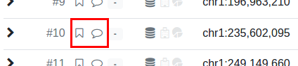
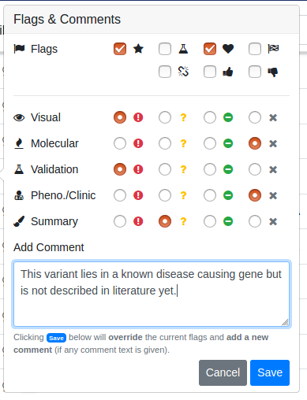
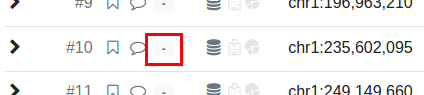
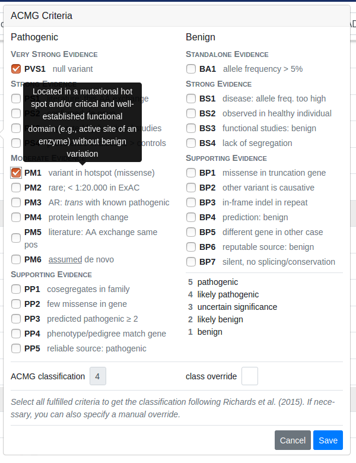
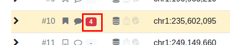
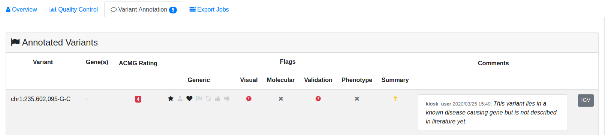

.. _variants_annotation:

==================
Variant Annotation
==================

.. contents::

------------------------
Variant Comments & Flags
------------------------

^^^^^^^^^^^^^^^^^^^^^^^^^
Creating Comments & Flags
^^^^^^^^^^^^^^^^^^^^^^^^^

    The flag marker (little bookmark) and comment marker (little text buble) are shown for each result row.
    They are filled when the flags have been set or a comment has been submitted for the variant.

Use the little bookmark-shaped or text bubble icon next to each variant to open the "flagging / comment" window.
Check the desired flags and/or enter your comment text in the text box below.
Click :guilabel:`Save` to create a new comment and/or flags.

    When clicking the flag/comment markers, the "Flags & Comments" popup opens.
    Select the flags that you want to apply and/or enter a comment in the text box and then click the :guilabel:`Save` button.
    The :guilabel:`Summary` label also determines the color of the result row (green, yellow, red, or no coloring).
    Selecting no :guilabel:`Summary` but any other flag will highlight the result row in gray.

.. figure:: figures/annotation_comments_flags_marker_marked.png
    :alt: The filled flag and comment marker next to result rows.
    :width: 80%
    :align: center

    The flag and comment marker are now filled.

^^^^^^^^^^^^^^^^^^^^^^^^^^
Exporting Comments & Flags
^^^^^^^^^^^^^^^^^^^^^^^^^^

You can export comments and flags together with your variants into an Excel file.

^^^^^^^^^^^^^^^^^^^^^^^^
Viewing Comments & Flags
^^^^^^^^^^^^^^^^^^^^^^^^

.. figure:: figures/annotation_comments_flags_variant_details.png
    :alt: Comments and flags in variant details
    :width: 80%
    :align: center

    Comments and flags are displayed when expanding the variant details.

The comments and flags for a variant are displayed in the variant details.
For this, click the arrow at the beginning of a resulting row.
The comments and flags are displayed in the box in the top right of the expanded variant details.

Alternatively, you can also view your comments and flags in the case details overview as described below in the "Viewing Annotations" section.

-----------
ACMG Rating
-----------

    The ACMG marker (little gray box with a dash in the middle) is shown for each result row.
    It is filled with the ACMG rating and a corresponding coloring when the ACMG rating has been set for the variant.

Use the little gray box next to each variant to open the "ACMG Rating" window.
Check the desired classifications and click :guilabel:`Save` to create a ACMG rating.
The actual class is automatically computed.
You can override the computation and set your own class by entering a number in the :guilabel:`Class override` box.

    When clicking the ACMG marker, the "ACMG Rating" popup opens.
    Select the classes that you want to apply and then click the :guilabel:`Save` button.
    The actual class is automatically computed.
    You can override the computation and set your own class by entering a number in the :guilabel:`Class override` box.

    The ACMG rating marker is now filled.

-------------------
Viewing Annotations
-------------------

You can get a complete list of all the comments, flags and ACMG ratings for a case in the case details view.
For this, go back to the case detail page and click on :guilabel:`Variant Annotations`.

    You can see all variant flags, comments and ACMG ratings in the case details view.
