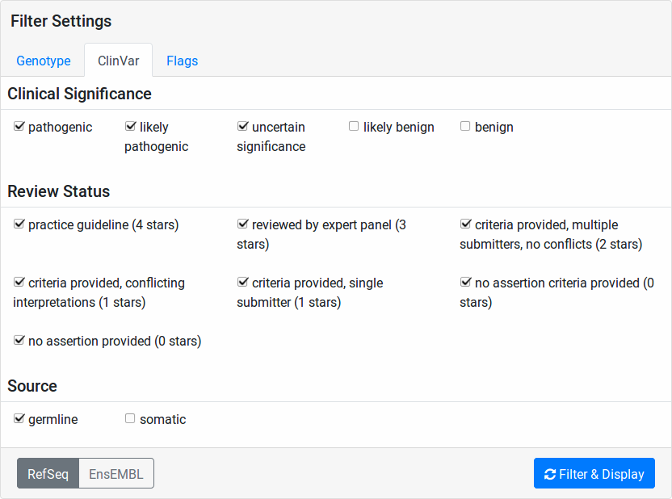

.. _variants_clinvar:

==============
ClinVar Report
==============

Besides filtering all variants based on the various criteria described in :ref:`variants_filtration`, you can also perform a Clinvar-centric search.
On the Case Details Page, you can reach the filter mask using the :guilabel:`ClinVar Report` button on the top right.
This will take you to the **ClinVarReport View**.

On the top of the page, you can see the **ClinVar Report Form** for setting the parameters for creating your ClinVar report.
Below, the results will be displayed after submitting the form.

.. note::

    As with the :ref:`variants_filtration` form, VarFish will store every query that you make.
    When loading the ClinVar Report form, your previous form settings will be restored and a notification will be displayed to notify you of this.

-------------------
ClinVar Report Form
-------------------

The form has the following components:

- :guilabel:`Genotype` tab
- :guilabel:`ClinVar` tab
- :guilabel:`Flags` tab
- :guilabel:`RefSeq / ENSEMBL` switch
- :guilabel:`Filter & Display` button

:guilabel:`Genotype` Tab
========================

.. figure:: figures/clinvar_genotype_tab.png
    :alt: The Genotype form tab on the ClinVar report.
    :width: 80%
    :align: center

    The ClinVar form showing the :guilabel:`Genotype` tab.

This is the same as the :ref:`variants_filtration_genotype_tab` in the :ref:`variants_filtration` tab.

:guilabel:`ClinVar` Tab
========================

    The ClinVar form showing the :guilabel:`ClinVar` tab.

This tab allows you to perform a fine-granular select of the variants to include in the form.

**Clinical Significance**
    Select the clinical significance (as defined by ClinVar) that the result variants should have.
    This ranges from **pathogenic** to **benign**.
    The default and recommendation is to include all except for bening/likely benign.

    .. warning::

        A large number of variants in ClinVar are actually flagged as **benign**.
        To keep the report to the relevant variants (and query times short), it is not recommended to query for benign variants.

**Review Status**
    This allows to limit variants to certain review statuses.
    It is recommended to keep the default of enabling all review statuses.

**Source**
    Select germline and/or somatic variants.
    It is recommended to only select germline variants.

:guilabel:`Flags` Tab
=====================

.. figure:: figures/clinvar_genotype_tab.png
    :alt: The Genotype form tab on the ClinVar report.
    :width: 80%
    :align: center

    The ClinVar form showing the :guilabel:`Flags` tab.

Here, you can limit the reported variants to those with a specific flag or rating.
See :ref:`variants_flagging` for an explanation of flags and ratings.

:guilabel:`RefSeq / ENSEMBL` Switch
===================================

This allows you to change between RefSeq or ENSEMBL transcripts for the primarily reported variants.
Note that the Clinvar-provided transcript- and protein-level annotations remain untouched from this.

:guilabel:`Filter & Display` Button
===================================

Use this button for submitting the form.

--------------------
ClinVar Report Items
--------------------

.. warning::

    The structure of the ClinVar report is subject to change.
    We try to keep this documentation up to date but it might get outdated.

The report will only report variants that are

- present in ClinVar AND
- match the filter criteria you selected in the form.

The report will first report the number of reported variants and the number of ClinVar entries that this is based of and an explanation of the sorting.

.. note::

    For performance reasons, most 500 ClinVar records are used to create the report at the moment.
    In the case that there were more variants, this count will also be reported next to a small yellow warning sign ``/!\``.

    **This will lead to pathogenic variants being overshadowed by benign variants**.

    This **should** only be the case if you included benign variants.
    If you see this limit as a problem, please report it as a bug via email.

Next, the report will show the result records item by item.
The items will first be stratified by pathogenicity, descendingly from pathogenic to benign.
ClinVar contains multiple entries for each genomic variant, generally one for each submission/publication.
The submission with the highest pathogenicity rating will be used for the pathogenicity of the variant.

Within each pathogenicity stratum, the variants will be sorted by ClinVar review status (4 stars/practice guideline to 0 stars/no assertion provided).
The review status of the submission with the highest pathogenicity rating will be used for the result item.

.. note::

    Currently, a higher review status might be assigned to the result item in some corner cases.
    However, no lower review status will reported, so you will not miss any pathogenic variants if you validate the VarFish reports using the original ClinVar site.

For each entry, the rank and total number of entries is displayed as ``#$rank / $total items`` (e.g., "#1/42").
Next, a description of the change as ``$chrom-$position-$ref_bases-$alt_bases`` is displayed (e.g., "chr1-12,061,532-C-T").

All of this is followed by the following variant properties (see :ref:`variants_filtration` for their description):

- Sequence Ontology variant effect with highest pathogenicity
- HGNC-approved gene name
- HGNC-approved gene symbol
- transcript-level change
- protein-level change
- name of the gene family

This is followed by the display of the genotypes in your pedigree's members.

Finally, the ClinVar records for this variant are displayed, each with:

- ClinVar reference entry ID ``RCV...``
- ClinVar significance
- ClinVar review status
- List of annotated traits
- Variant origin (germline and/or somatic)
