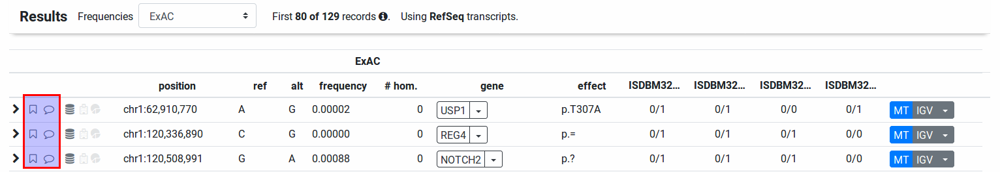
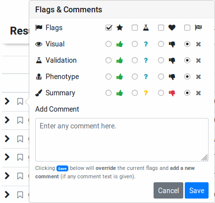
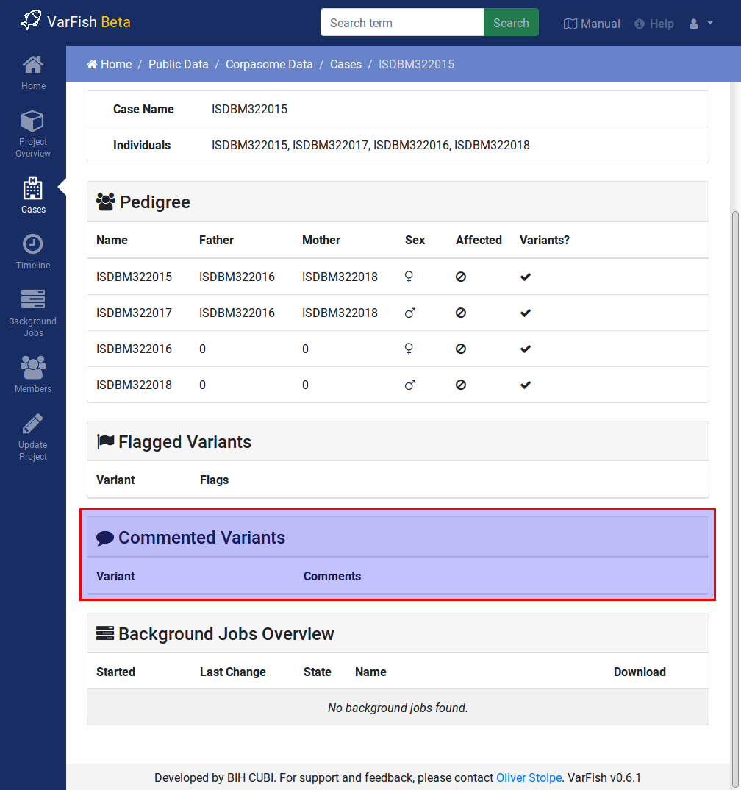

.. _variants_comments:

================
Variant Comments
================

.. note::

    Updating or modifying comments will be added in a future version.

.. contents::

-----------------
Creating Comments
-----------------

    The flag marker (little bookmark) is shown for each result row (also for each ClinVar result item).
    It is filled then flag have been set for the variant.

Use the little bookmark-shaped icon next to each variant or ClinVar report entry item to open the "flagging / comment" window.
Leave the flags unchanged and enter your comment text in the text box below.
Click :guilabel:`Save` to create a new comment.

    When clicking the flag/comment markers, the "Flags & Comments" popup opens.
    Select the flags that you want to apply and then click the :guilabel:`Save` button.
    The :guilabel:`Summary` label also determines the color of the result row (green, yellow, red, or no coloring).

----------------
Viewing Comments
----------------

Next to each variant, the little text bubble icon is filled if there is any comment for the variant.

    You can see all variant comments in the case details view.

At the moment, comment texts are only displayed on the case detail page.

------------------
Exporting Comments
------------------

You can export comments together with your variants into an Excel file.
