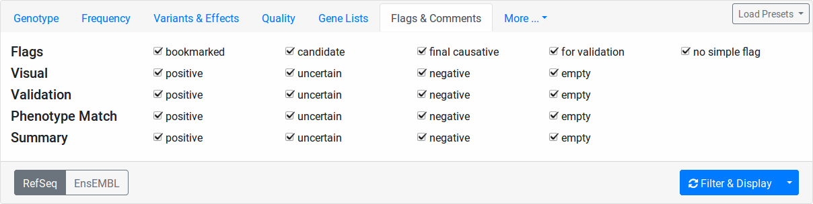
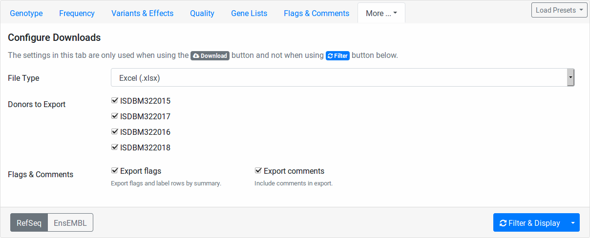
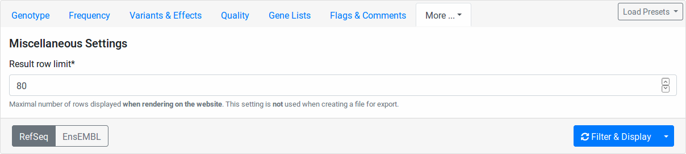
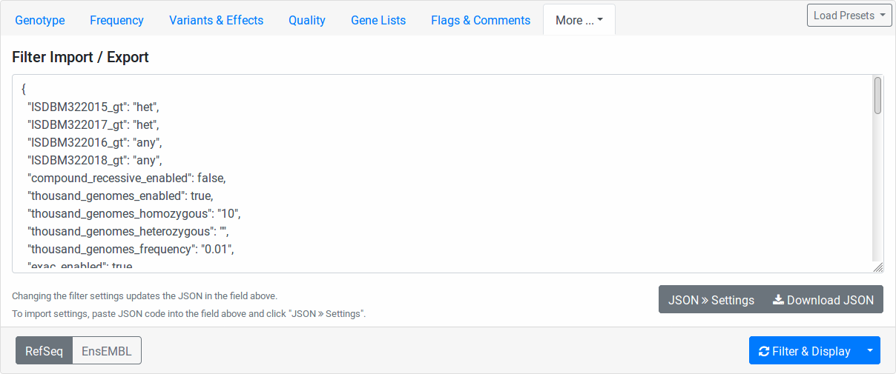

.. _variants_filtration:

==================
Variant Filtration
==================

.. contents::

This view allows you to filter variants to a number of criteria.
Further, you can trigger an export of the variants with your current criteria to a downloadable VCF, Excel, or TSV file.

You can open the variant filtration view for each case by first navigating to the case's detail page and then clicking then :guilabel:`Filter Case` button on the top right.

On the top of the page, you can see the **Variant Filtration Form** for setting the parameters for creating your filtration.
Below, the results will be displayed after submitting the form.

.. note::

    VarFish will store every query that you make.
    When loading the filtration form, your previous form settings will be restored and a notification will be displayed to notify you of this.

.. note::

    The implementation of the variant filter in VarFish is monolithic as we use the data from the user submitted form to compile a single, rather large, SQL query from it.
    This enables us to have a very efficient (in terms of computing time and resources) filtering step.
    The downside of this is that we can't track how many variants are actually filtered out by which filter setting.

-----------------------
Variant Filtration Form
-----------------------

.. note::

    As in many places, VarFish offer in-place online help:
    Move your mouse cursor over any item to display its tooltip description (if it has any).

The form has the following components.
Note that some form tabs will be hidden below the :guilabel:`More...` tab depending on your screen size.

- :guilabel:`Genotype` tab
- :guilabel:`Frequency` tab
- :guilabel:`Variants & Effects` tab
- :guilabel:`Quality` tab
- :guilabel:`Gene Lists` tab
- :guilabel:`Flags & Comments` tab
- :guilabel:`ClinVar & HGMD` tab
- :guilabel:`Configure Downloads` tab
- :guilabel:`Miscalleneous` tab
- :guilabel:`Filter Import Export` tab
- :guilabel:`Load Presets` button
- :guilabel:`RefSeq / ENSEMBL` switch
- :guilabel:`Filter & Display` button
    - The little triangle on the right gives access to the :guilabel:`Download as File` and :guilabel:`Submit to MutationDistiller` menu entries.

.. _variants_filtration_genotype_tab:

Genotype
========

.. figure:: figures/filtration_genotype_tab.png
    :alt: The Genotype form tab on the Variant Filtration form.
    :width: 80%
    :align: center

In this tab, the individuals of your pedigree are displayed with their name, father and mother, sex, and disease state.

Here, you can configure the genotype pattern that you want to query for.
The :guilabel:`Genotype` column contains select fields for each of your pedigree individuals.
The value meanings are:

**any** (default)
    Any genotype is allowed.
**0/0**
    The genotype of this individual should be reference.
**0/1**
    The genotype of this individual should be heterozygous.
**1/1**
    The genotype of this individual should be homozygous alternative.
**variant**
    The genotype of this individual should be heterozygous OR homozygous alternative.
**non-variant**
    The genotype of this individual should be reference or no-call (``./.``).
**non-reference**
    The genotype of this individual should be heterozygous OR homozygous alternative OR no-call (``./.``).

Further, you can check the :guilabel:`enable comp. het. mode` checkbox.
In this case, the values of the :guilabel:`Genotype` column's select fields are ignored.
Instead, the list of variants will be filtered as follows:

1. All variants are filtered according to the remaining tabs of the filtration form (all except :guilabel:`Genotype`).
2. Two sets of variants are created:
    a. A *paternal set* with variants that are in heterozygous state in both the index and the father and which are reference in the mother.
    b. A *maternal set* with variants that are in heterozygous state in both the index and the mother and which are reference in the father.
3. For each gene occuring in either set, the number of variants are counted, leading to *paternal count* and *maternal count* for each gene.
4. Only those genes where both the paternal and maternal count is above zero are kept.
5. All variants where the paternal and the maternal count are above zero are reported.
   This can include variants where the paternal or maternal count is above one.

.. note::

    The compound heterozygous mode currently only works if you have a full trio in your data set (father/mother/child).
    Further, only the genotypes of these three individuals will be considered in the filtration.

Frequency
=========

.. figure:: figures/filtration_frequency_tab.png
    :alt: The Frequency form tab on the Variant Filtration form.
    :width: 80%
    :align: center

Here you can filter variants by their relative frequency in variation databases or how often they occur within in heterozygous or homozygous state.
The population databases are 1000 Genomes Phase 3, ExAC, genomAD exomes, and gnomAD gnomes.
You switch on/off a population for consideration by the little checkbox on the left.

The column :guilabel:`Homozygous count` limits the number of maximal occurences of a variant in homozygous state for each database.
For example, setting ``10`` for *1000 Genomes*, all variants occuring 11 times or more often in the 1000 Genomes dataset will be excluded.
The :guilabel:`Heterozygous count` field works the same way but for number of heterozygous state.

The :guilabel:`Frequency` field works as follows.
Here, you specify the maximal frequency in any **sub population** of the given database.
For example, setting ``0.01`` for *ExAC*, you will exclude all variants occuring with a higher frequency than 1% in any sub population, e.g., if the variant has 2% in the African ExAC samples and 0.1% in the European samples, then it will be excluded.

In all homozygous/heterozygous/frequency fields, you can disable the corresponding filter by leaving the field empty.

Variants & Effects
==================

.. figure:: figures/filtration_effects_tab.png
    :alt: The Variants & Effects form tab on the Variant Filtration form.
    :width: 80%
    :align: center

This tab allows for the fine-granular selection of variants based on the variant effects.

The **Variant Types** section allows you to select whether to include SNVs (single nucleotide variants, e.g., A>C), Indels (insertions or deletions, e.g., AC>T, A>CT, ACT>GG), or MNVs (multi-nucleotide variants where reference and alternative allele have the same number of bases and more than one base is affected, e.g., CC>TT, CCC>TTT).

The **Transcript Type** section allows you to select whether to include coding and/or non-coding variants.

In the **Detailed Effects** section, you can perform selection of variants on the finest level of granularity.
The **Effect Groups** allow you to quickly select and unselect fields from the Detailed Effects section.

Quality
=======

.. figure:: figures/filtration_quality_tab.png
    :alt: The Quality form tab on the Variant Filtration form.
    :width: 80%
    :align: center

This tab allows you to set quality thresholds on the genotype calls on a per-sample level.
Further, you control how calls not passing the threshold in individuals are treated.

**min DP het.**
    Minimal coverage of heterozygous variants to pass the quality filter.
**min DP hom.**
    Minimal coverage of homozygous variants to pass the quality filter.
**min AB**
    Minimal allelic balance.
    This settings is applied to heterozygous variant calls only.
    Given a variant with total coverage *c* and *a* reads supporting the alter native allele, the allelic balance *AB* is defined as *a/c*.
    A well-balanced variant has an allelic balance that is not too far from 0.5.
    To pass the quality filer, the allelic balance must be: *min AB <= AB <= 1 - min AB*.
**min GQ**
    Minimal (Phred-scaled) genotype quality for variants to pass the quality filter.
**min AD**
    Minimal number of reads supporting the alternative allele to pass the quality filter.

The "on FAIL" column determines the action to take for variants that don't pass the quality filter:

**drop variant**
    The whole variant is removed from the result if the quality filter fails in this individual.
    This makes a low-quality call in the particular sample remove the variant even if the quality is high in other individuals.
**ignore**
    The quality filter is ignored for the particular sample.
**no-call**
    The variant in this individual is counted as "no-call" in the :guilabel:`Genotype` filter settings.

Gene Lists
==========

.. figure:: figures/filtration_gene_lists_tab.png
    :alt: The Gene Lists form tab on the Variant Filtration form.
    :width: 80%
    :align: center

Enter any Entrez gene ID, ENSEMBL gene ID, HGNC/HUGO gene symbol in the Gene Blacklist field to remove variants in this gene from the result list.
If a variant affects more than one gene, blacklisting one of them will not blacklist them in the other genes.

Similarly, enter any Entrez gene ID, ENSEMBL gene ID, HGNC/HUGO gene symbol into the Gene Whitelist field to limit variants to those in the white-listed genes.
Leave the whitelist empty to not apply any white-listing.

Flags & Comments
================

Here you can filter your variants based on the user-provided flags.

.. _variants_filtration_clinvar_hgmd_tab:

ClinVar & HGMD
==============

.. figure:: figures/filtration_clinvar_hgmd_tab.png
    :alt: The ClinVar & HGMD form tab on the Variant Filtration form.
    :width: 80%
    :align: center

You can use this to require membership in ClinVar and HGMD Public.
When requiring ClinVar membership, you can limit the reported variants to those with a particular pathogenicity.

Note that the HGMD Public data is taken from the ENSEMBL browser and is several years behind the current HGMD Public and Professional versions.

Configure Downloads
===================

These fields allow you to configure how your file downloads are created.
You can select the file type to use for the exprot (Excel, TSV, or VCF).

Further, you can select the individuals to include.
This is useful for generating single-individual VCF files if you want to use tool that does not support multi-sample VCF files.

Also, you can select whether you want to export your flags and comments.

Miscalleneous
=============

Here you can select a row limit on the online variant display.

This limit will not be applied to your file downloads.

Filter Import Export
====================

Here you find the configuration stored in JSON format.
While the format is machine and not human-oriented, it allows you to save your current form settings in a text file and restore them later.

Click the :guilabel:`Download JSON` button to download a text file with the value of the text area above.
Clicking the :guilabel:`JSON >> Settings` button applies the changes from the text area to the form.
The text area is automatically updated to reflect the current form settings when you change any form field.

Load Presets
============

Here you find shortcuts to several presets.
Note that these are "factory" defaults at the moment.
Currently, it is not possible to create your own presets.
This will be possible in a future version.

RefSeq / ENSEMBL switch
=======================

Use this to choose between RefSeq and ENSEMBL transcripts when filtering for variant effects.

Filter & Display Button
=======================

Use this button to perform a new query with the current form settings and display the results below.

.. _download-as-file:

Download as File
----------------

When clicking on the little triangle next to the :guilabel:`Filter & Display` you can select the :guilabel:`Download as File` menu item.
This will start a background job on the server to create a downloadable file from your current form settings.
Note that the values from the :guilabel:`Configure Downloads` will be used for configuring the exported files while the row limit from the :guilabel:`Miscalleneous` will not be applied.

.. note::

    VCF exports are meant for exporting whole exomes from VarFish (thousands of rows).
    In contrast, Excel and TSV exports are meant for exporting exomes filtered to "interesting" variant sets (up to hundreds of rows)

    VCF export is much faster than Excel and TSV export.
    For performance reasons, filtration of VCF file exports is limited to the basics.
    Filtration, for genotype, frequency, variant effect etc., gene white-/blacklist work as well as basic ClinVar membership.
    Filtration for HGMD public membership, clinvar details, user comments and flags is not applied to VCF exports.

    Exports to TSV and Excel use the same filters as displayed when clicking on :guilabel:`Filter & Display`.

.. _submit-to-mutation-distiller:

Submit to MutationDistiller
---------------------------

Also, the little triangle next to the :guilabel:`Filter & Display` gives you access to the :guilabel:`Submit to MutationDistiller` action.
This is similar to generating a downloadable VCF file.
However, clicking the button will submit the data to MutationDistiller after confirming this once again in popup window.

Here are the actions to create the recommended settings for submitting to MutationDistiller:

- Select the appropriate Genotype configuration that you want to submit to MutationDistiller.
- Note that MutationDistiller only supports single-sample VCF files at the moment.
  Go to the :guilabel:`Configure Downloads` tab via :menuselection:`More ... --> Configure Downloads` and unselect all but the one individual that is to be exported.
- Load presets for pulling **all** variants from the original VCF file via :menuselection:`Load Presets --> Full Exome`.
- Click the little triangle next to :guilabel:`Filter & Display`, then click :guilabel:`Submit to MutationDistiller`.
- A confirmation popup appears.
  Read the text carefully and then confirm the submission.
- This will create a background job that first generates a VCF file with all selected variants and then submits this file to MutationDistiller.

.. note::

    The MutationDistiller submission uses the same feature as th VarFish VCF export.
    Thus, the limitations described in :ref:`download-as-file` apply.

--------------------------
Variant Filtration Results
--------------------------

.. figure:: figures/filtration_results.png
    :alt: The filtration results display.
    :width: 80%
    :align: center

After form submission, the results are displayed below the form.

Filtration Results Header
=========================

The header contains a :guilabel:`Frequencies` switch that allows you to select the database for display population frequencies.
Further, it shows the number of displayed and the number of result records.
Lastly, it displays the transcript data source used.

.. warning::

    Always monitor the number of displayed vs. total records.
    You might have to adjust the number of displayed rows so you don't miss any variants!

Result Rows
===========

The result rows consist of the following elements:

- Clicking right-pointing arrow will show you more details on your variant below the result row.
- The little bookmark sign indicates whether the variant has been flagged (filled if flags are present).
  The summary flag status is also indicated by the row color.
  Click on the bookmark sign to adjust the flags for this variant.
- The little speech bubble indicates whether there are any comments for this flag (filled if comments are present).
- The little database icon (three disks) indicates dbSNP membership of the variant (dark if present in dbSNP, very light if not).
  Click on the icon to go to its dbSNP entry.
- The little hospital icon indicates ClinVar membership (again dark if present in ClinVar, very light if not).
- The little circle indicates membership in HGMD Public (see :ref:`variants_filtration_clinvar_hgmd_tab` for information about HGMD Public age).
- The following columns indicate the variant position, reference and alternative bases.
- This is followed by the frequency display from the population database selected in the header.
- The next column shows the gene symbol, clicking on the little triangle next to it allows you to see the variant in various databases.
- The variant effect on the protein level in HGVS notation.
  Moving the cursor over this field will show a textual explanation of the effect.
- The next columns show the genotypes in the individuals.
  Moving the cursor over this field will show the genotype quality and number of reference and alternative reads.
- The :guilabel:`MT` button will query MutationTaster for this variant.
- The :guilabel:`IGV` button opens the selected locus in IGV if you have it open in the background and :menuselection:`View --> Preferences --> Advanced --> Enable port`` activated and the port set to ``60151``.
- Clicking the little triangle next to :guilabel:`IGV` allows you to open the variant locus in various other genome browsers.

