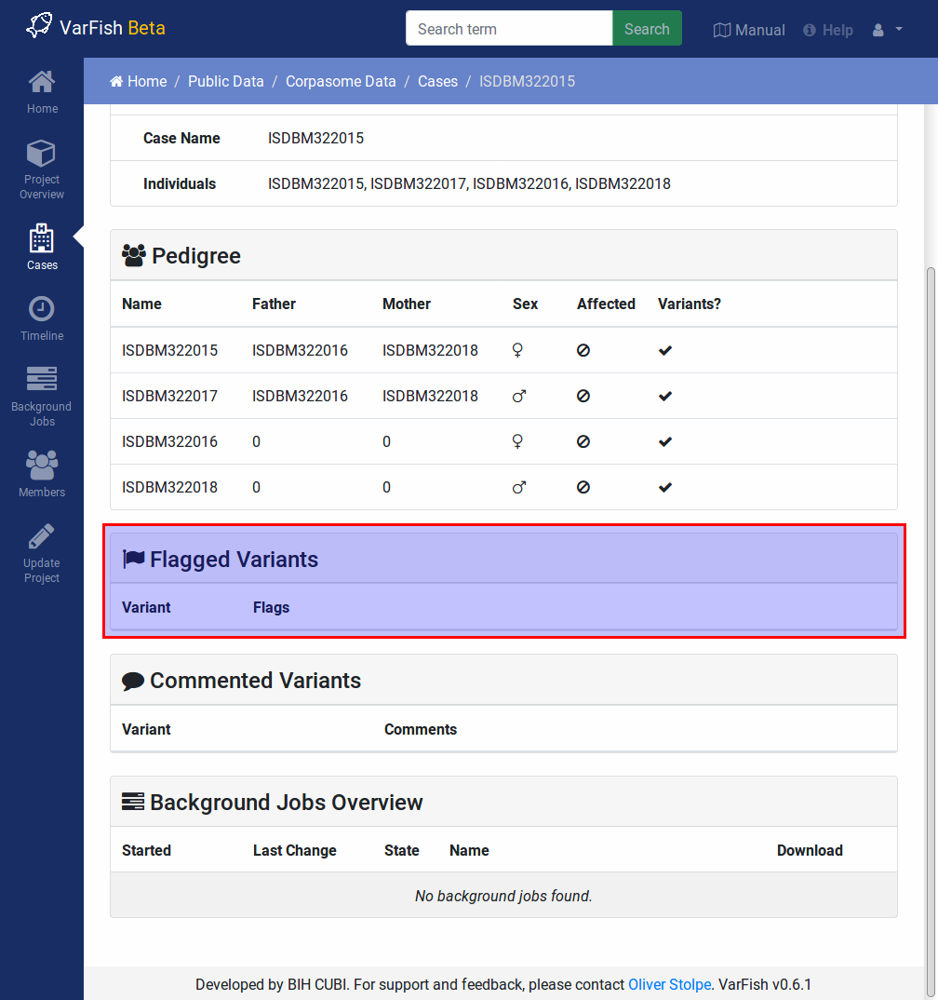

.. _variants_flagging:

================
Variant Flagging
================

-------------
Setting Flags
-------------

.. figure:: figures/comments_marker.png
    :alt: The flag and comment marker next to result rows.
    :width: 80%
    :align: center

    The flag marker (little bookmark) is shown for each result row (also for each ClinVar result item).
    It is filled then flag have been set for the variant.

Use the little bookmark-shaped icon next to each variant or ClinVar report entry item to open the "flagging / comment" window.
Set the flags to you liking and c :guilabel:`Save` to save the flags for this variant.

.. figure:: figures/comments_comment_popup.png
    :alt: The Flags & Comments form tab on the Variant Filtration form.
    :width: 80%
    :align: center

    When clicking the flag/comment markers, the "Flags & Comments" popup opens.
    Select the flags that you want to apply and then click the :guilabel:`Save` button.
    The :guilabel:`Summary` label also determines the color of the result row (green, yellow, red, or no coloring).

-------------
Viewing Flags
-------------

Next to each variant, the little text bookmark icon is filled if any flags have been set for the variant.

    You can see all flagged variants in the case details view.

Flag details are also displayed on the case detail page.

------------------
Exporting Comments
------------------

You can export flags together with your variants into an Excel file.
